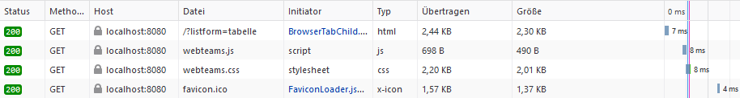
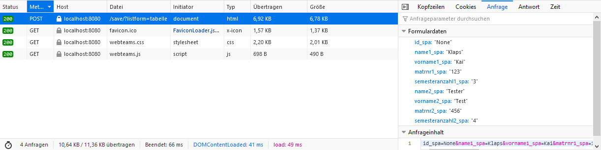

## Dokumentation zum ersten WEB-Praktikum
__Datum: 26.11.2020__

__Team:__

- Kai Klaps, Matthias Wiese

- Marvin Schlitter, Tomas Kublickas

### Aufbau der Webanwendung:
Die Webanwendung besteht grundsätzlich aus __zwei Seiten:__

__Startseite:__
Auflistung der Daten aller erfassten Team.
Hier befinden sich Buttons zum: __erfassen, bearbeiten und löschen__ der Teams.
Zusätzlich gibt es noch einen Button zum __ändern__ der Ansicht.

__Formular:__
Hier werden neue Daten erfasst oder vorhandene Daten bearbeitet
Es befinden sich Button zum __speichern__ des Formulars und zum __abbrechen__ der Eingabe.

### Durchgeführte Ergänzungen:
Es wurde die Möglichkeit hinzugefügt eine zweite Person je Team einzutragen und die Semesteranzahl je Student hinzuzufügen.

Zusätzlich wurden features hinzugefügt um Einträge zu löschen und die Darstellungart der Daten zu ändern.

### Beschreibung des HTTP-Datenverkehrs:
- beim Start der Anwendung

__Anfrage:__ GET localhost:8080/

__Antwort:__ HTML Dokument der Startseite

- beim Speichern von Formulardaten

__Anfrage:__ POST localhost:8080/save/?listform=tabelle

__Antwort:__ HTML Dokument der Startseite (Mit der voherigen Darstellungform)

